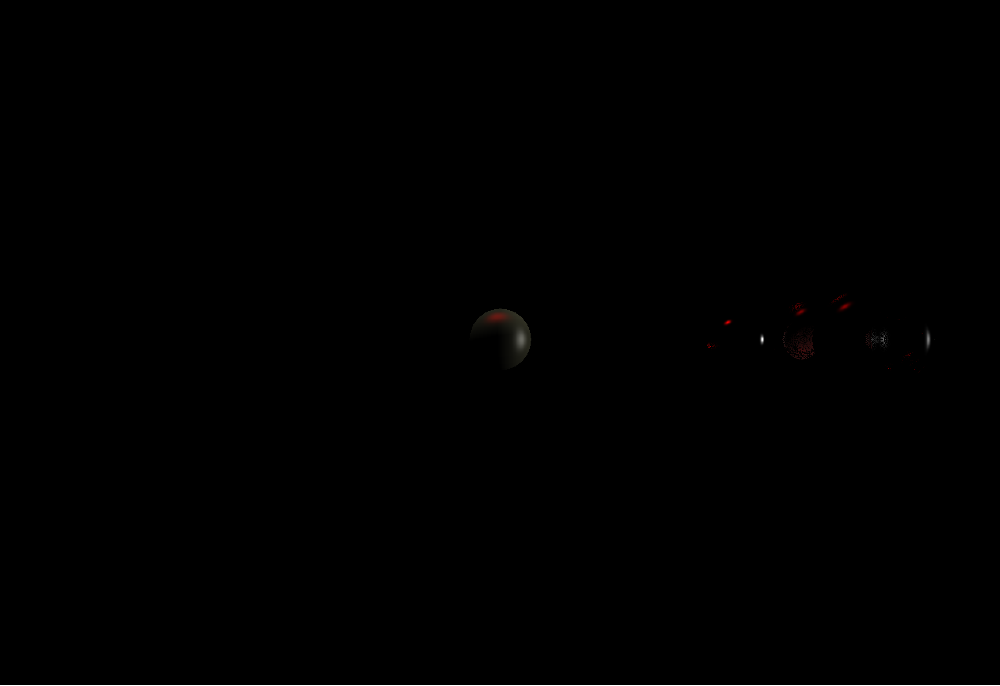

# Raytracer (Proyecto 2)

Raytracer en Zig con [raylib](https://www.raylib.com/) para desplegar el framebuffer. Renderiza esferas con iluminación de Phong (difusa + especular), sombras, reflejos y refracción/transparencia.

## Cómo se ve



## Requisitos

- [Zig](https://ziglang.org/) 0.16.0

## Correrlo

```sh
zig build run
```

Optimizado (recomendado, es notablemente más rápido):

```sh
zig build run -Doptimize=ReleaseFast
```

### Controles

- `W` / `S`: inclinar la cámara arriba / abajo
- `A` / `D`: orbitar la cámara alrededor de la escena

## Qué implementa

- **Intersección rayo-esfera** (`src/sphere.zig`).
- **Iluminación de Phong**: componente difusa (`N·L`) y especular (`R·V` elevado al exponente del material) por cada luz de la escena (`src/main.zig`, `cast_ray`).
- **Sombras**: por cada luz se lanza un rayo desde el punto de impacto; si otro objeto lo bloquea antes de llegar a la luz, esa luz no contribuye en ese punto (`obscured` en `src/main.zig`).
- **Reflejos** y **refracción/transparencia** recursivos, controlados por las propiedades del material (`Reflectividad`, `Transparencia`, `Refractive_index`).

## Estructura

```
src/
  main.zig        - loop principal, cámara, escena y el raytracer (cast_ray, obscured)
  raytracer.zig    - tipos base: Light, Material, Intersect
  sphere.zig       - geometría de esfera e intersección
  formas.zig       - unión de formas soportadas (Forma)
  camera.zig       - cámara orbital (lookAt, Right/Up/Forward)
  framebuffer.zig  - buffer de píxeles que se sube a una textura de raylib
  cute_colors.zig  - utilidades de color
```
